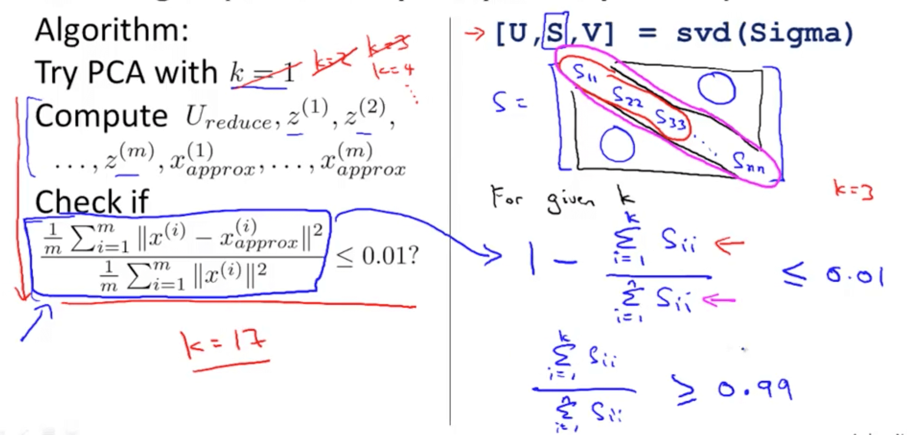

# Notes

## W1

## W2 - Multivariate Linear Regression

## Gradient Descent in Practice

### 1. Feature Scaling
Feature scaling is a method used to normalize the range of independent variables or features of data.

**Motivation:** Range of values of raw data varies widely &rarr; in some machine learning algorithms, objective functions will not work properly without normalization.

For example, if we use Euclidean distance and one of the features has a broad range of values, our result will be governed by this feature &rarr; the range of all features should be normalized so that each feature contributes approximately proportionately to the final distance.

It makes sure features are on similar scale &rarr; helps GD converge more quickly.

Ex:

x<sub>1</sub> = size (0 - 2000 feet<sup>2</sup>) &rarr; x<sub>1</sub> = size (in feet<sup>2</sup>) / 2000

x<sub>2</sub> = number of bedrooms (1-5) &rarr; x<sub>2</sub> = number of bedrooms / 5

### 2. Mean normalization

Replace x<sub>i</sub> with x<sub>i</sub> - μ<sub>i</sub> to make features have approximately zero mean.

Do not apply to x<sub>0</sub> = 1

There is another form of the means normalization which is when we divide by the standard deviation which is also called standardization.

### 3. Debugging Gradient Descent

Make a plot with number of iterations on the x-axis. Now plot the cost function, J(θ) over the number of iterations of gradient descent. If J(θ) ever increases, then you probably need to decrease α.

**Automatic convergence test**

Declare convergence if J(θ) decreases by less than E in one iteration, where E is some small value such as 10−3. However in practice it's difficult to choose this threshold value.

### Summary

* If α is too small: slow convergence.

* If α is too large: J(θ) may not decrease on every iteration and thus may not converge.

## Notes on Vectorization


### Unvectorized implementation

**Pseudocode:**

``` 
prediction = 0.0;
for j = 1:n+1:  // MathLab is 1-indexed
        prediction = prediction + theta(j) * x(j)
end;
```

### Vectorized implementation

* More efficient

**Pseudocode:**

``` 
prediction = theta' * x;
```

---

## Helpful explanation of the math

If you are wondering how the seemingly complex looking for loop can be vectorized and cramped into a single one line expression, then please read on. The vectorized form is:

``` 
theta = theta - (alpha/m) * (X' * (X * theta - y))
```

Given below is a detailed explanation for how we arrive at this vectorized expression using gradient descent algorithm:

This is the gradient descent algorithm to fine tune the value of θ:


Assume that the following values of X, y and θ are given:

* m = number of training examples
* n = number of features + 1

enter image description here


Here:

* m = 5 (training examples)
* n = 4 (features+1)
* X = m x n matrix
* y = m x 1 vector matrix
* θ = n x 1 vector matrix
* xi is the ith training example
* xj is the jth feature in a given training example

Further, 

* `h(x) = ([X] * [θ])` (m x 1 matrix of predicted values for our training set)
* `h(x)-y = ([X] * [θ] - [y])` (m x 1 matrix of Errors in our predictions)

whole objective of machine learning is to minimize Errors in predictions. Based on the above corollary, our Errors matrix is m x 1 vector matrix as follows:


**To calculate new value of θj, we have to get a summation of all errors (m rows) multiplied by jth feature value of the training set X**. That is, take all the values in E, individually multiply them with jth feature of the **corresponding** training example, and add them all together. This will help us in getting the new (and hopefully better) value of θj. Repeat this process for all j or the number of features. In matrix form, this can be written as:


This can be simplified as:


* `[E]' x [X]` will give us a row vector matrix, since E' is 1 x m matrix and X is m x n matrix. But we are interested in getting a column matrix, hence we transpose the resultant matrix.

More succinctly, it can be written as:


Since `(A * B)' = (B' * A')` , and `A'' = A` , we can also write the above as


This is the original expression we started out with:

``` 
theta = theta - (alpha/m) * (X' * (X * theta - y))
```

---

## W3 - Advanced Optimization

``` 
function [jVal, gradient] = costfunction(theta)

// cost function J
jVal = (theta(1)-5)^2 + ... + (theta(2)-5)^2;

// 2x1 vector
gradient = zeros(2,1);

gradient(1) = 2 * (theta(1)-5);
gradient(2) = 2 * (theta(2)-5);
```

In Octave, we can use `fminunc()` 

Options is a data structure that stores the options we want to set. Here, we set the number of max iterations to 100 iterations.

``` 
options = optimset('GradObj', 'on', 'MaxIter', '100');

// initial guess of theta
initialTheta = zeros(2,1);

[optTheta, functionVal, exitFlag] = fminunc(@costFunction, initialTheta, options);
```

This `fminunc()` function will return the optimal value for theta and also the function value at the optimum.

**Note:** Theta has to be a vector with dimension >= 2. If theta is just a real number, this `fminunc()` will not work.

---

## Basic Form

Theta is a n-dimentional vector.

Note that MathLab indexes from 1, not 0.

``` 
function [jVal, gradient] = costFunction(theta)

jVal = [Code to compute J(theta)]

gradient(1) = [Code to compute partial derivative of J(theta) using theta(1)]

gradient(2) = [Code to compute partial derivative of J(theta) using theta(2)]

...

gradient(n+1) = [Code to compute partial derivative of J(theta) using theta(n+1)]
```

---

# The Problem of Overfitting


1. Underfitting
2. Just right
3. Overfitting

### Underfitting

* Also called "high bias"
* When the form of our hypothesis function h maps poorly to the trend of the data
* Usually caused by a function that is too simple or uses too few features.

### Overfitting

* Also called "high variance"
* A hypothesis function that fits the available data but does not generalize well to predict new data
* Usually caused by a complicated function that creates a lot of unnecessary curves and angles unrelated to the data.
* If we have too many features, the learned hypothesis may fit the training set very well (cost function is almost 0), but may fail to generalize to new examples (predict prices on new examples, in the housing price case).

### Address Overfitting:

1. Reduce number of features:
* Manually select which features to keep
* Model selection algorithm
* Cons: Throw features away --> less info

2. Regularization
* Keep all features but reduce magnitude/values of parameters
* Works well when we have a lot of features, each of which contributes a bit to predicting *y*.

## Regularized Cost Function

If we have overfitting from our hypothesis function, we can reduce the weight that some of the terms in our function carry by increasing their cost.

Without actually getting rid of these features or changing the form of our hypothesis, we can instead modify our cost function by adding regularization term.

The λ, or lambda, is the **regularization parameter**. It determines how much the costs of our theta parameters are inflated.

With regularization, we can add another term to control the 2 goals (1 is to fit the training data well, 2 is to control the magnitude of the parameters).


**Why adding a positive term makes this work?**

* Regularization increases the cost based on the absolute value of the thetas. Since you’re minimizing the cost, that puts pressure on the thetas to be smaller (i.e. reduce the magnitude of theta).

---

## W4 - Neural Network

## Model Representation


The Neural Network is constructed from 3 type of layers:

* Input layer — initial data for the neural network. usually are noted as vector X

* Hidden layers — intermediate layer between input and output layer and place where all the computation is done. These circles represent the “activation” nodes and usually are noted as W (weights) or θ.

* Output layer — produce the result for given inputs (or the predicted value).

Each node is connected with each node from the next layer and each connection (black arrow) has particular weight. Weight can be seen as impact that that node has on the node from the next layer.


(x0 is 1, called "bias node")

---

## Model Representation Mathematics


*  “bias” nodes as x₀ and a₀ respectively

* the input nodes can be placed in one vector X and the nodes from the hidden layer in vector A.


> If network has a units in layer j and b​ units in layer j+1, then θⱼ will be of dimension b​×(a+1).


To compute the “activation” nodes for the hidden layer, we need to multiply the input vector X and weights matrix θ¹ for the first layer (X*θ¹)and then apply the activation function g.


And by multiplying hidden layer vector with weights matrix θ for the second layer(A*θ) we get output for the hypothesis function:


Ref: https://towardsdatascience.com/everything-you-need-to-know-about-neural-networks-and-backpropagation-machine-learning-made-easy-e5285bc2be3a

---

# Applications

## Examples and Intuition


g(z)


---

## Multiclass Classification

To classify data into multiple classes, we let our hypothesis function return a vector of values. Say we wanted to classify our data into one of four categories. We will use the following example to see how this classification is done. This algorithm takes as input an image and classifies it accordingly:


We can define our set of resulting classes as y:


Each y (i) represents a different image corresponding to either a car, pedestrian, truck, or motorcycle. The inner layers, each provide us with some new information which leads to our final hypothesis function. The setup looks like:


The resulting hypothesis for one set of inputs may look like [0 0 1 0], which represents a motorcycle.

----

### Why do we need to provide the cost function and the derivative?

* Cost function is to use in forward-propagate (performing this by directly applying the cost function)

* Derivative of the cost function is to use in back-propagate.

Ref: https://medium.com/datathings/neural-networks-and-backpropagation-explained-in-a-simple-way-f540a3611f5e

## W5

---

## W6

## Troubleshooting errors in our predictions

 - Getting more data (training examples) --> fixes high variance
 - Trying smaller sets of features --> fixes high variance
 - Trying additional features --> fixes high bias (usually)
 - Trying polynomial features --> fixes high bias
 - Increasing lambda λ --> fixes high variance
 - Decreasing lambda λ --> fixes high bias

## Evaluating a Learning Algorithm

1. Split data into training and test, 70% and 30% respectively. Procedure becomes

 - Learn Θ and minimize J-train(Θ) using the training set
 - Compute error on test set J-test(Θ)

2. Split the data into 60% training data, 20% cross validation data, and 20% test data.

 - Approach: compute the J-train(Θ) on various polynomial degrees
 - Optimize Θ using training set for each polynomial degrees
 - Find the polynomial degree *d* with the least error using the **cross validation set**
 - Estimate the generalization error using the test set with J-test(Θ-d) (Θ-d is Θ from the polynomial with lower error)

## Bias vs. Variance

How to diagnose these 2 things?

1. High bias (underfitting):

 - J-train and J-CV high
 - J-CV is roughly the same as J-train

Why? Because they both are underfitted

2. High variance (overfitting):

 - J-train is low
 - J-CV is much higher than J-train

Why? Since overfitting means we're fitting the training data really well, the error J(train) is low.
But overfitting doesn't generalize well to new data, so J(CV) is higher.


## Regularization and Bias/Variance

The problem of choosing lambda λ:

* Large λ (λ = 10000 for example) means we're punishing the extra features heavily, which leads to the values of thetas being really low --> h(x) ~= theta-0 --> High bias (underfitting)
* Small λ (λ = 0 for example) means that we're fitting the data set perfectly -- i.e. High variance (overfitting)
* Want: Just right λ

Approach:

1. Create a list of λ (multiple of 2, for ex: i.e. λ ∈ {0,0.01,0.02,0.04,0.08,0.16,0.32,0.64,1.28,2.56,5.12,10.24})
2. Create a set of models with different degrees/any other variants
3. Iterate through the λs and for each λ, go through all the models to learn some Θ (on training data)
4. Compute the cross validation error using the learned Θ (computed with λ) on the J-CV **without regularization or λ = 0**
5. Select the best combo that produces the lowest error on the cross validation set
6. Using the best combo of Θ and λ, apply it on J-test to see if it has a good generalization of the problem.

## Diagnosing Neural Networks

* A neural network with fewer parameters is prone to underfitting. It is also computationally cheaper.
* A large neural network with more parameters is prone to overfitting. It is also computationally expensive. In this case you can use regularization (increase λ) to address the overfitting.

Using a single hidden layer is a good starting default. You can train your neural network on a number of hidden layers using your cross validation set. You can then select the one that performs best.

### Model Complexity Effects

Lower-order polynomials (low model complexity) have high bias and low variance. In this case, the model fits poorly consistently.
Higher-order polynomials (high model complexity) fit the training data extremely well and the test data extremely poorly. These have low bias on the training data, but very high variance.
In reality, we would want to choose a model somewhere in between, that can generalize well but also fits the data reasonably well.

---

## Building a Spam Classifier

### Prioritizing What to Work On

System Design Example:

Given a data set of emails, we could construct a vector for each email. Each entry in this vector represents a word. The vector normally contains 10, 000 to 50, 000 entries gathered by finding the most frequently used words in our data set. If a word is to be found in the email, we would assign its respective entry a 1, else if it is not found, that entry would be a 0. Once we have all our x vectors ready, we train our algorithm and finally, we could use it to classify if an email is a spam or not.

So how could you spend your time to improve the accuracy of this classifier?

* Collect lots of data (for example "honeypot" project but doesn't always work)
* Develop sophisticated features (for example: using email header data in spam emails)
* Develop algorithms to process your input in different ways (recognizing misspellings in spam).

It is difficult to tell which of the options will be most helpful.

### Error Analysis

The recommended approach to solving machine learning problems is to:

* Start with a simple algorithm, implement it quickly, and test it early on your cross validation data.
* Plot learning curves to decide if more data, more features, etc. are likely to help.
* Manually examine the errors on examples in the cross validation set and try to spot a trend where most of the errors were made.

For example, assume that we have 500 emails and our algorithm misclassifies a 100 of them. We could manually analyze the 100 emails and categorize them based on what type of emails they are. We could then try to come up with new cues and features that would help us classify these 100 emails correctly. Hence, if most of our misclassified emails are those which try to steal passwords, then we could find some features that are particular to those emails and add them to our model. We could also see how classifying each word according to its root changes our error rate:


It is very important to get error results as a single, numerical value. Otherwise it is difficult to assess your algorithm's performance. For example if we use stemming, which is the process of treating the same word with different forms (fail/failing/failed) as one word (fail), and get a 3% error rate instead of 5%, then we should definitely add it to our model. However, if we try to distinguish between upper case and lower case letters and end up getting a 3.2% error rate instead of 3%, then we should avoid using this new feature. Hence, we should try new things, get a numerical value for our error rate, and based on our result decide whether we want to keep the new feature or not.

---

### Handling Skewed Data

Skewed classes basically refer to a dataset, wherein the number of training example belonging to one class out-numbers heavily the number of training examples beloning to the other.

### Precision/Recall

**Precision**

(Of all patients where we predicted y = 1, what fraction actually have cancer?)

Precision = True positives / # Total predicted positives = True positive / (True positives + False positives)

* High precision is good (we make accurate prediction)

**Recall**

(Of all patients that actually have cancer, what fraction did we correctly detect as having cancer?)

Recall = True positives / # actual positives = True positives / (True positives + False negatives)

* High recall is good

**Trading Off Precision and Recall**

* Use the F score to compare the precision/recall numbers and select the algorithm with the higher F score

---

## W7 - SVM in practice

* Use SVM software package (eg. `liblibear` , `libsvm` , ...) to solve for parameters θ.
* But we need to specify:
    - Choice of parameter C
    - Choice of kernel (similarity function)

### Kernel

1. No kernel ("linear kernel")
  + Predict "y=1" if θ' * x >= 0
  + Use when: n (# of features) is large, m (# of training set) is small

2. Gaussian kernel
  + Need to choose σ^2
    - large σ^2: high bias, low variance
    - small σ^2: low bias, high variance
  + Good when n is small, m is large
  + **Need to perform feature scaling before using the Gaussian kernel** to reduce the effect of some features that have large ranges

### Multi-class Classification

* Many SVM packages already have built-in multi-class classification functionality
* Otherwise, use one-vs-all method:
    - Train K SVMs, one to distinguish y = i from the rest, for i = 1, 2, ..., K
    - Get θ(1), θ(2),..., θ(K)
    - Pick class i with largest θ(i)-transposed * x

### Logistic Regression vs. SVMs

* n = # of features
* m = # of training examples

1. **If n is large (relative to m)** – for example, spam classification problem with n = 10,000 features and m = 10 to 10,000 examples (or  Text Classification, as each alphabet is a new feature)

* Use logistic regression, or SVM without a kernel ("linear kernel")
* **Why?**: if we have so many features with smaller training sets, a linear function will probably do fine + we don't really have enough data to fit a very complicated nonlinear function.

2. **If n is small and m is intermediate** – for ex, n is up to 1000 and m ~ 10 to 50,000
* SVM with Gaussian kernel

3. **If n is small, m is large** (n=1-1000, m=50,000+)
* Create/add more features, then use logistic regression or SVM without a kernel

**Note**: Neural network likely to work well for most of these settings, but may be slower to train.

---

## W8 - Principal Component Analysis (PCA)

**Problem Formulation:** Reduce from 2D to 1D by finding a direction (a vector u(1) ∈ R^n) onto which ot project tha data so as to minimize the projection error.

**Generalize**: Redice from n-D to k-D by finding k vectors u(1), u(2), ..., u(k) onto which ot project tha data so as to minimize the projection error.


* PCA is a dimension reduction technique. PCA does not involve a dependent variable: All the variables are treated the same. It is primarily dimension reduction method.
* Linear regression attempts to model the relationship between two variables by fitting a linear equation to observed data.

### Principal Component Analysis Algorithm

**Preprocessing** (feature scaling/mean normalization)

* Mean Normalization: Replace each feature x with x - its mean.
* Feature scaling -- so all features have comparable range of values *((x - mean)/ range)*

**Algorithm**

* Reduce data from n-D to k-D
* Compute "covariance matrix"
* Compute "eigenvectors" of matrix Σ

**Notes**:

* In Octave: `[U, S, V] = svd(Sigma)` 
* SVD: Signular Value Decomposition
* k: number of principal components (that we want to retain)
* Sigma is n x n matrix
    - In Octave, the vectorized implementation of Signma is: `Sigma = (1/m) * X' * X` 


Putting together:

``` 
[U, S, V] = svd(Sigma)
Ureduce = U(:, 1:k)
z = Ureduce' * x
```

### Reconstruction from Compressed Representation

`X-approx = Ureduce * z` 

### Choosing the Number of Principal Components k




* run SVD once, which gives us the S matrix
* Using the procedure on the right, slowly increase k and pick smallest value of k for which the formula at the bottom is satisfied (>= 0.99)

### Advice for Applying PCA


### Application of PCA

1. Compression --> Choose k by % of variance retain
* Reduce memory/disk needed to store data
* Speed up learning algorithm

2. Visualization --> k = 2 or k = 3

----

# Week 9 - Recommender System


## Content Based Recommendations


1. add an extra feature interceptor feature X0, which is equal to 1

2. set n to be the number of features, not counting this X zero intercept term so n is equal to two because we have two features x1 and x2

3. to make predictions, we could treat predicting the ratings of each user as aseparate linear regression problem. So specifically lets say that for each user j we are going to learn a parameter vector theta J which would be in r n+1, where n is the number of features,and we're going to predict user J as rating movie I, with just the inner product between the parameters vector theta and the features "XI".

### Optimization algorithm: Estimate of parameter vector theta j


1. to simplify the subsequent math,get rid of this term MJ.that's just a constant.
2. because our regularization term here regularizes only the values of theta JK for K not equal to zero.we don't regularize theta 0.

3. can also plug them into a more advanced optimization algorithm like cluster gradient or L-BFGS and use that to try to minimize the cost function J as well.

4. content based recommendations,because we assume that we have features for the different movies.that capture what is the content of these movies. How romantic/action is this movie?And we are really using features of the content of the movies to make our predictions.

5. Suppose there is only one user and he has rated every movie in the training set. This implies that nu=1 and r(i,j)=1 for every i,j . In this case, the cost function J(θ) is equivalent to the one used for regularized linear regression.
